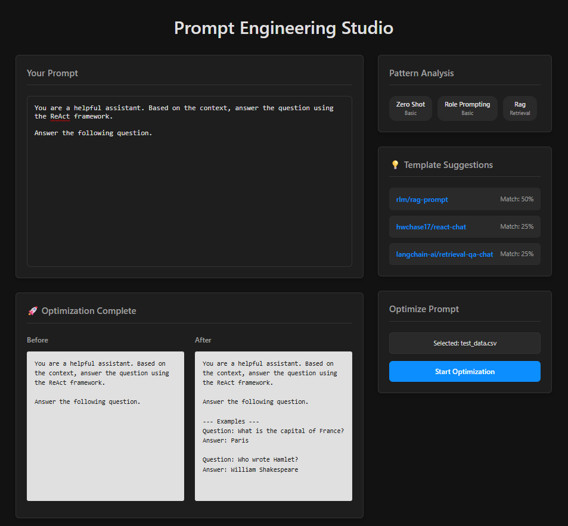

# Prompt Engineering Studio 🚀

An open-source IDE for designing, analyzing, and optimizing LLM prompts. This tool provides real-time feedback and powerful automation to help developers and researchers create more effective prompts.



---

## ## ✨ Key Features

* **Real-time Pattern Analysis:** Instantly identifies common prompt engineering patterns (like Zero-Shot, Role Prompting, Chain-of-Thought) as you type.
* **Intelligent Template Suggestions:** Recommends relevant prompt templates from LangChain Hub based on the detected patterns in your prompt.
* **Automated Prompt Optimization:** Uses **DSPy** to automatically optimize your prompts by generating few-shot examples from a small dataset you provide.
* **Modern UI:** A clean, responsive, dark-themed interface built for an efficient and pleasant workflow.

---

## ## 🛠️ Tech Stack

| Frontend                | Backend                          |
| ----------------------- | -------------------------------- |
| **React** | **Python 3.10+** |
| **TypeScript** | **FastAPI** |
| **Vite** | **DSPy** (`dspy-ai`)             |
| **Axios** | **LangChain** |
| **CSS Modules** | **Ollama** (for local LLM hosting) |
|                         | **Uvicorn** (ASGI Server)        |
|                         | **uv** (Package Manager)         |

---

## ## 🏁 Getting Started

Follow these instructions to set up and run the project on your local machine.

### ### Prerequisites

Make sure you have the following installed:
* **Node.js** (v18 or later)
* **Python** (v3.10 or later)
* **uv** (Python package manager): `pip install uv`
* **Ollama**: Download and install from [ollama.com](https://ollama.com/).
    * Pull a model to be used for optimization: `ollama run gemma:2b`

### ### Installation & Setup

1.  **Clone the repository:**
    ```sh
    git clone <your-repository-url>
    cd Prompt-Engineering-Studio
    ```

2.  **Set up the Backend:**
    ```powershell
    # Navigate to the backend directory
    cd backend

    # Create and activate the virtual environment
    uv venv
    .\.venv\Scripts\Activate.ps1

    # Install the required packages
    uv pip install fastapi uvicorn[standard] websockets python-dotenv langchain dspy-ai pandas python-multipart

    # (Optional) Create a requirements.txt file
    uv pip freeze > requirements.txt
    ```

3.  **Set up the Frontend:**
    ```powershell
    # Navigate to the frontend directory from the root
    cd frontend

    # Install npm packages
    npm install
    ```

### ### Running the Application

You will need two separate terminals to run both the backend and frontend servers.

1.  **Run the Backend Server:**
    * In a terminal at the `backend` directory:
    * Make sure Ollama is running in the background.
    * Activate the virtual environment: `.\.venv\Scripts\Activate.ps1`
    * Start the server: `uvicorn app.main:app --reload`
    * The API will be available at `http://127.0.0.1:8000`

2.  **Run the Frontend Server:**
    * In another terminal at the `frontend` directory:
    * Start the development server: `npm run dev`
    * The UI will be available at `http://localhost:5173`

---

## ## 📊 Project Status

### ### ✅ Completed (MVP v1.0)

* **Core UI/UX:** Fully functional two-column layout with a polished dark theme.
* **Pattern Detector:** Rule-based detector for identifying over 20 common prompt patterns.
* **Template Suggester:** Ranks and suggests templates from a predefined map based on pattern confidence scores.
* **DSPy Optimization:** Integrated `BootstrapFewShot` optimizer that accepts a prompt and a CSV/JSONL dataset.
* **Comparison View:** A side-by-side view to compare the original prompt with the DSPy-optimized version.

### ### 📝 Planned (Future Features)

* **LLM-as-a-Refiner:** An optional toggle to use an LLM to enhance the accuracy of pattern detection.
* **Advanced DSPy Metrics:** Integrate an "LLM-as-a-Judge" to allow optimization for qualitative metrics (e.g., style, engagement, safety).
* **UI-Based Dataset Builder:** A simple form to help users create small test datasets directly in the UI.
* **Prompt Version History:** Allow users to save different versions of a prompt and track changes over time.
* **Export Options:** Add buttons to export the final prompt as a JSON object or a Python script.
* **User Accounts & Collaboration:** Introduce user authentication, saved prompts, and shared workspaces.

---

## ## 📄 License

This project is licensed under the MIT License.