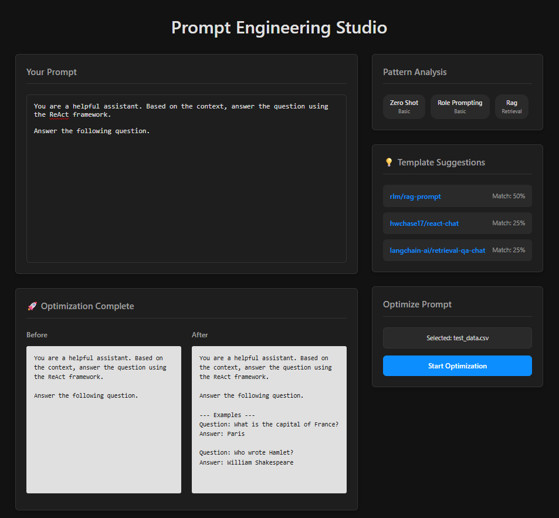
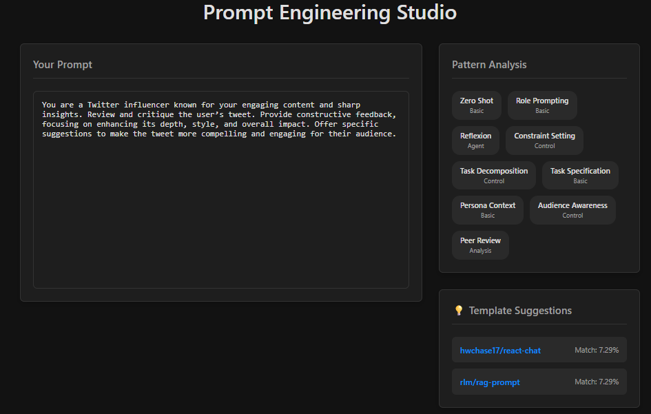
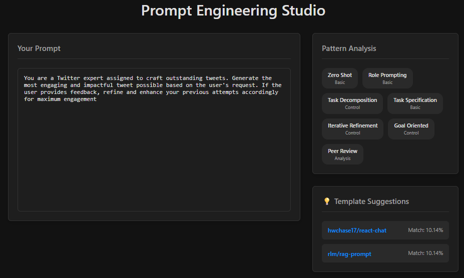

# Prompt Engineering Studio 🚀

An open-source IDE for designing, analyzing, and optimizing LLM prompts. This tool provides real-time feedback and powerful automation to help developers and researchers create more effective prompts.


### 🚀 Prompt Optimization Interface
*Advanced DSPy optimization with before/after comparison*



### 📝 Pattern Analysis View
*Real-time pattern detection and template suggestions*



### 🎨 Main Application Interface
*Complete prompt engineering workflow with analysis panel*



---

## ✨ Key Features

* **Real-time Pattern Analysis:** Instantly identifies common prompt engineering patterns (like Zero-Shot, Role Prompting, Chain-of-Thought) as you type.
* **LLM-as-a-Refiner:** Advanced pattern detection accuracy using LLM refinement for enhanced analysis precision (optional toggle).
* **Intelligent Template Suggestions:** Recommends relevant prompt templates from LangChain Hub based on the detected patterns in your prompt.
* **Automated Prompt Optimization:** Uses **DSPy** to automatically optimize your prompts by generating few-shot examples from a small dataset you provide.
* **Modern UI:** A clean, responsive, dark-themed interface built for an efficient and pleasant workflow.

---

## 🛠️ Tech Stack

| Frontend                | Backend                          |
| ----------------------- | -------------------------------- |
| **React** | **Python 3.10+** |
| **TypeScript** | **FastAPI** |
| **Vite** | **DSPy** (`dspy-ai`)             |
| **Axios** | **LangChain** |
| **CSS Modules** | **Ollama** (for local LLM hosting) |
|                         | **Uvicorn** (ASGI Server)        |
|                         | **uv** (Package Manager)         |

---

## 🏁 Getting Started

Follow these instructions to set up and run the project on your local machine.

### Prerequisites

Make sure you have the following installed:
* **Node.js** (v18 or later)
* **Python** (v3.10 or later)
* **uv** (Python package manager): `pip install uv`
* **Ollama**: Download and install from [ollama.com](https://ollama.com/).
    * Pull a model to be used for optimization: `ollama run gemma:2b`

### Installation & Setup

1.  **Clone the repository:**
    ```sh
    git clone <your-repository-url>
    cd Prompt-Engineering-Studio
    ```

2.  **Set up the Backend:**
    ```powershell
    # Navigate to the backend directory
    cd backend

    # Create and activate the virtual environment
    uv venv
    .\.venv\Scripts\Activate.ps1

    # Install the required packages
    uv pip install fastapi uvicorn[standard] websockets python-dotenv langchain dspy-ai pandas python-multipart

    # (Optional) Create a requirements.txt file
    uv pip freeze > requirements.txt
    ```

3.  **Set up the Frontend:**
    ```powershell
    # Navigate to the frontend directory from the root
    cd frontend

    # Install npm packages
    npm install
    ```

### Running the Application

You will need two separate terminals to run both the backend and frontend servers.

1.  **Run the Backend Server:**
    * In a terminal at the `backend` directory:
    * Make sure Ollama is running in the background.
    * Activate the virtual environment: `.\.venv\Scripts\Activate.ps1`
    * Start the server: `uvicorn app.main:app --reload`
    * The API will be available at `http://127.0.0.1:8000`

2.  **Run the Frontend Server:**
    * In another terminal at the `frontend` directory:
    * Start the development server: `npm run dev`
    * The UI will be available at `http://localhost:5173`

### Using LLM-as-a-Refiner

The application now includes an advanced LLM-as-a-Refiner feature for enhanced pattern detection accuracy:

1. **Enable the Feature:** In the Pattern Analysis panel, toggle "🤖 Use LLM Refiner"
2. **Configure LLM Provider:** Select your preferred provider (Ollama, OpenRouter, or Groq)
3. **Set Model:** Enter the model name (e.g., `gemma:2b` for Ollama)
4. **Add API Key:** For OpenRouter/Groq, provide your API key
5. **Enhanced Analysis:** The system will now use LLM refinement for improved pattern detection accuracy

**Note:** This feature requires a running LLM service (Ollama) or valid API credentials for cloud providers.

---

## 📊 Project Status

### ✅ Completed (MVP v1.0)

This is what has been successfully built and is currently working in the application.

* **Core Application Framework:** A robust backend using **FastAPI** and a dynamic frontend using **React** and TypeScript.
* **Real-time Pattern Analysis:** An integrated rule-based system that detects over 20 prompt engineering patterns as the user types.
* **Template Suggestions:** A system that suggests relevant **LangChain Hub** templates based on a weighted score of the detected patterns.
* **Flexible LLM Provider Support:** The UI and backend are configured to use **Ollama (local), OpenRouter, and Groq**.
* **DSPy-Powered Optimization:** The core optimization engine is built using **DSPy's `BootstrapFewShot`**, capable of improving a prompt from a user-provided CSV or JSONL dataset.
* **Basic Guardrails:** The DSPy optimizer is configured with basic limits on the number of examples to generate (`max_boot_strapped_demos`).
* **Comparison UI:** A polished, side-by-side view to clearly compare the original prompt with the optimized version.

### 🚀 Completed (v1.1 - Enhanced AI Features)

* **LLM-as-a-Refiner:** Advanced pattern detection accuracy using LLM refinement for enhanced analysis precision with optional toggle in Pattern Analysis panel.

---

## 🗺️ Planned Future Features

This is the roadmap for what can be built on top of the current MVP foundation.

### Core Functionality Enhancements
* **Intelligent Template Merging:** A feature to automatically map a user's original prompt content into the variables of a selected Hub template.
* **UI-Based Dataset Builder:** A simple form within the application to help users create small test datasets from scratch without needing a CSV file.
* **Export Options:** Buttons to export the final, optimized prompt as a ready-to-use JSON object or Python script.

### Advanced AI & Optimization
* **Advanced DSPy Metrics (LLM-as-a-Judge):** The ability to optimize prompts against qualitative metrics like "style," "engagement," or "safety," not just exact matches.
* **Cost Estimation (Human in the Loop):** A feature that estimates the potential cost of a DSPy optimization job and asks the user for confirmation before running.
* **Configurable Guardrails & Timeouts:** A UI to allow users to set their own limits on optimization time, LLM calls, or iterations to better manage resources.

### Platform & Workflow
* **Prompt Version History:** The ability to save different versions of a prompt, add notes, and easily revert to previous versions.
* **A/B Testing Framework:** A dedicated UI to compare two different prompt versions against a dataset and see which one performs better on key metrics.
* **User Accounts & Collaboration:** A full authentication system allowing users to save their prompts to the cloud, create projects, and share them with team members.

---

## 📄 License

This project is licensed under the MIT License.